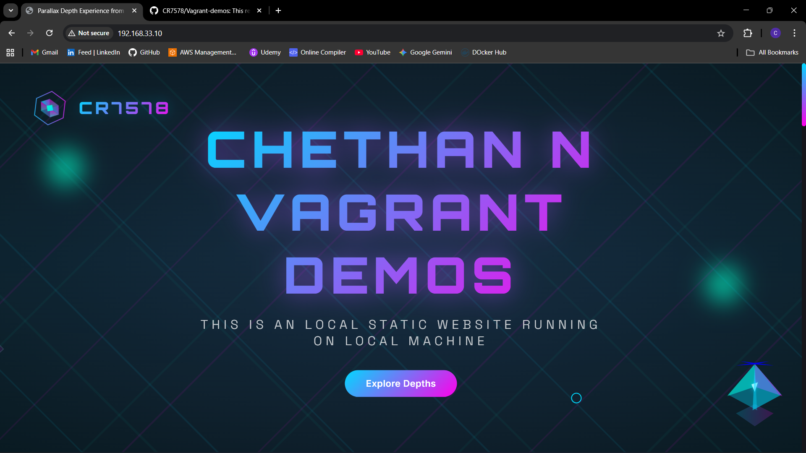
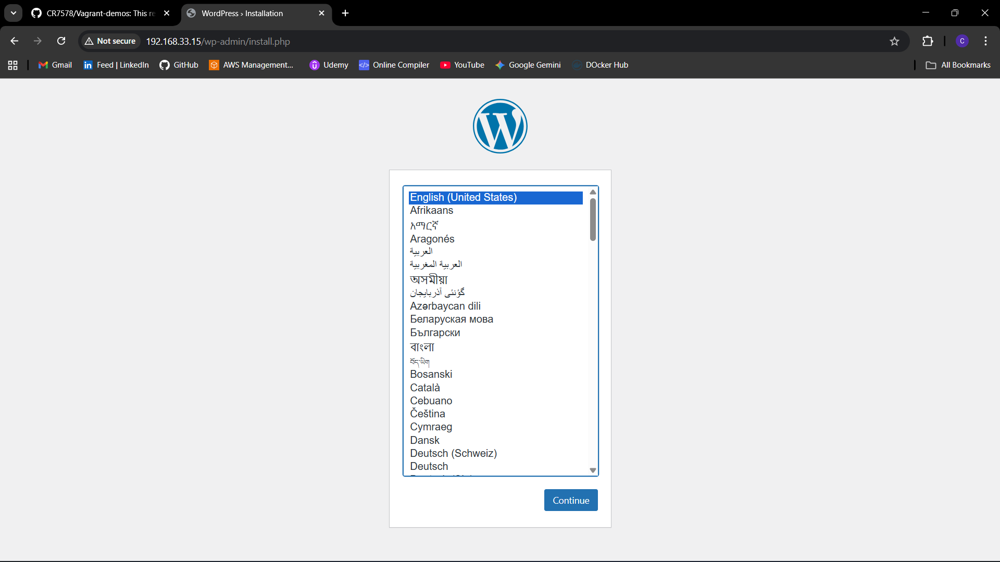
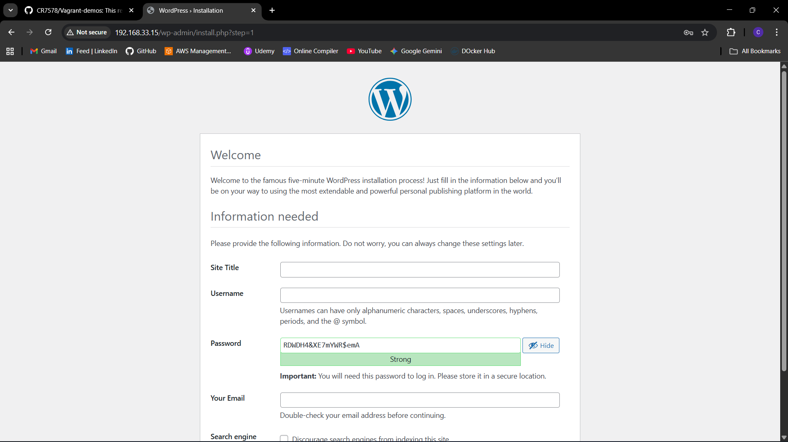
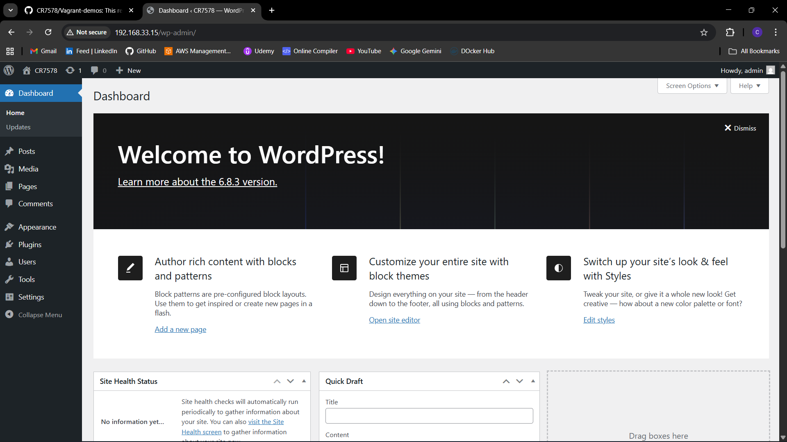

# Vagrant-demos

This repository contains small Vagrant-based demo projects that provision
development VMs for serving websites. It includes two example projects:

- `static-web` — a simple Apache-hosted static site VM
- `wordpress-web` — a LAMP stack VM that provisions WordPress

The README files inside each project contain full details. This top-level
README gives an overview and quick start instructions for both demos and
references the screenshots located in the `assets/` folder.

**Overview**

Each subfolder (`static-web` and `wordpress-web`) contains a `Vagrantfile`
that boots an Ubuntu Jammy VM (`ubuntu/jammy64`) and runs a provisioning
script. These are intended for local development and testing — not for
production use. The provisioning scripts install packages, configure Apache,
and place website files in the guest filesystem so you can quickly experiment
with web content.

**Projects**

- `static-web`
	- Purpose: host a static website using Apache.
	- Private IP (default): `192.168.33.10`
	- See: `static-web/README.md` for full instructions and customization notes.

- `wordpress-web`
	- Purpose: provision a LAMP stack and install WordPress into `/srv/www/wordpress`.
	- Private IP (default): `192.168.33.15`
	- See: `wordpress-web/README.md` for full instructions, DB credentials, and troubleshooting.

**Quick Start**

1. Install prerequisites on your host machine:

	 - `Vagrant` (2.x recommended)
	 - `VirtualBox` or another Vagrant provider
	 - On Windows, use Git Bash, WSL, or an elevated shell

2. Choose a demo and start it. Examples below assume a Bash-like shell.

	 Start the static web demo:

	 ```bash
	 cd static-web
	 vagrant up
	 # open http://192.168.33.10
	 ```

	 Start the WordPress demo:

	 ```bash
	 cd wordpress-web
	 vagrant up
	 # open http://192.168.33.15
	 ```

3. Helpful lifecycle commands (from inside a project folder):

	 - `vagrant ssh` — connect to the VM
	 - `vagrant provision` — re-run provisioning
	 - `vagrant halt` — stop the VM
	 - `vagrant destroy -f` — remove the VM

**Common Commands**
- `vagrant status` — show VM status
- `vagrant reload --provision` — restart and re-run provisioning
- `vagrant ssh -c "command"` — run a single command on the guest

**Images**

Screenshots and supporting images are stored in the `assets/` folder. Below
are a few examples used by the project READMEs:

# Static-web

---



# wordpress-web

---





**Troubleshooting**

- If Vagrant fails to start a VM, verify VirtualBox is installed and virtualization
	is enabled in BIOS/UEFI.
- If provisioning fails, try `vagrant provision` or `vagrant up --provision`.
- If the web page does not load, check the VM network configuration and ensure
	the private IPs above do not collide with your host network.

**Contributing / Notes**

- These Vagrantfiles are for learning and demo purposes. They use hard-coded
	credentials and simplified provisioning for convenience. Treat them as
	examples and avoid using them unchanged in production environments.
- Feel free to open an issue or submit a pull request to improve provisioning,
	add synced-folder examples, or parameterize credentials using environment
	variables.

---
For project-specific details, follow the links:

- `static-web/README.md`
- `wordpress-web/README.md`

Last updated: 2025-11-18
